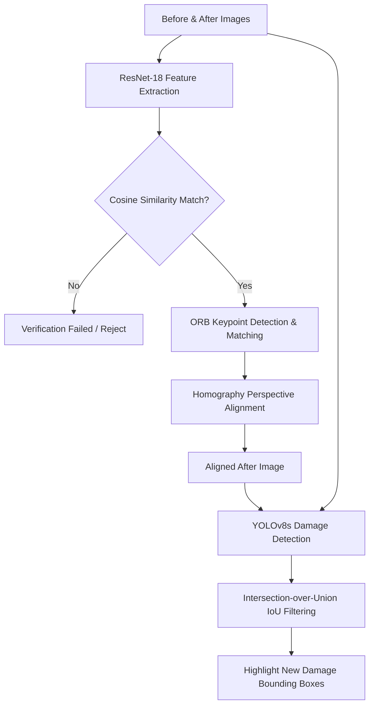
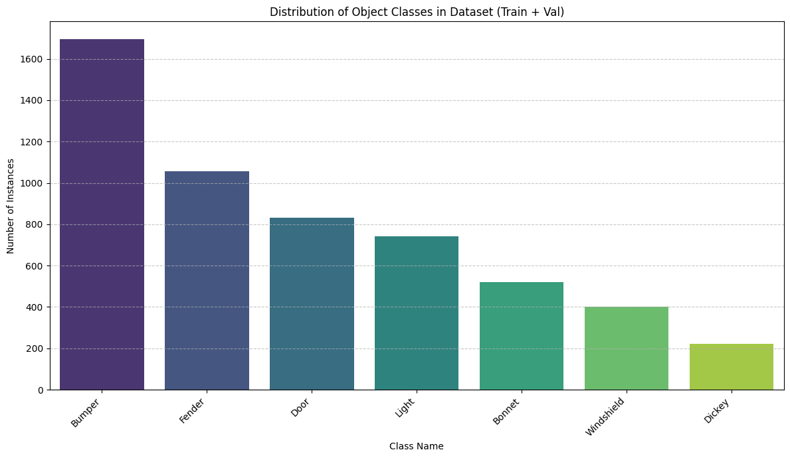
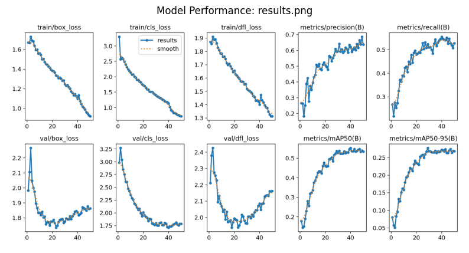
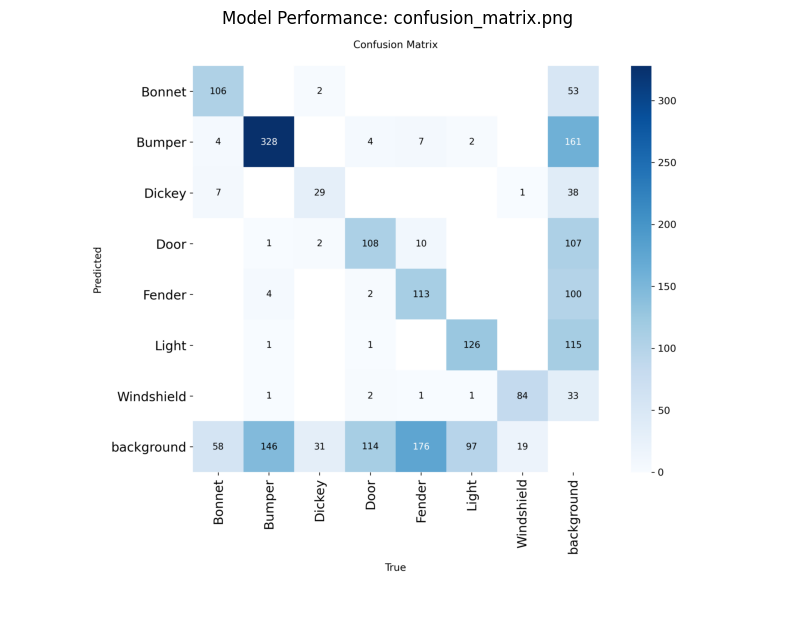

# Project Report: AI Car Damage Detection and Verification System

## Introduction and Purpose
The purpose of this project is to automate the vehicle damage inspection process by comparing two sets of photos representing the state of a vehicle before and after a rental period, insurance claim, or maintenance service. 

Traditional vehicle inspections are manual, subjective, and prone to disputes or fraud. By utilizing state-of-the-art computer vision models, this system validates the identity of the vehicle across views and identifies newly acquired damages (such as scratches, dents, or cracks on specific panels) while filtering out pre-existing ones.

This repository hosts both the complete source code and the training results. A live demonstration is available on Hugging Face Spaces.

* **Live Demo**: [Hugging Face Space Live Demo](https://huggingface.co/spaces/chandimabandara/AI-Car-Damage-Detection-System)
* **Dataset Source**: [Roboflow Capstone Car Damage Dataset (v4)](https://universe.roboflow.com/capstone-nh0nc/car-damage-detection-t0g92/dataset/4)

---

## System Architecture
The application integrates three core vision pipelines to deliver robust identity verification and localized damage comparison:

1. **Vehicle Identity Verification (ResNet-18)**: Extracts visual feature embeddings using a pre-trained ResNet-18 network. It calculates the cosine similarity between the reference and verification images to ensure they represent the same vehicle from equivalent angles, preventing spoofing or incorrect scans.
2. **Homography-Based Perspective Alignment (ORB)**: Detects keypoints and descriptors using Oriented FAST and Rotated BRIEF (ORB) on the grayscale representations of both photos. It computes a homography matrix using RANSAC to warp the "After" image to align with the "Before" reference perspective. This minimizes false positives caused by minor camera movement or shifts.
3. **Damage Detection and Filtering (YOLOv8s)**: Processes both aligned images through a custom-trained YOLOv8s object detection model. It checks for bounding box overlaps using Intersection-over-Union (IoU). Any newly detected car part containing damage in the "After" state that was not present in the "Before" state is isolated and marked as new damage.

---

## Dataset Analysis and Distribution
The custom YOLOv8 model was trained on version 4 of the Capstone Vehicle Damage Dataset on Roboflow. The dataset consists of annotated vehicle panels and damages categorized into 7 distinct classes: Bonnet, Bumper, Dickey, Door, Fender, Light, and Windshield.

The class distribution across the dataset is shown below, highlighting the representation of different vehicle body panels:

---

## Model Training and Loss Metrics
The damage detection component is powered by a YOLOv8s model trained for 50 epochs on a Tesla T4 GPU. The training progress and loss curves are displayed below, showing consistent convergence across box, classification, and distribution focal loss (DFL) on both training and validation splits:

---

## Model Validation Performance
Following the training of 50 epochs, the model was validated on the validation set containing 834 images and 1,588 instances. The class-wise validation metrics are summarized in the table below:

| Class | Images | Instances | Precision (P) | Recall (R) | mAP50 | mAP50-95 |
| :--- | :--- | :--- | :--- | :--- | :--- | :--- |
| **All Classes** | 834 | 1588 | 0.592 | 0.523 | 0.537 | 0.277 |
| **Bonnet** | 172 | 175 | 0.692 | 0.538 | 0.591 | 0.313 |
| **Bumper** | 472 | 481 | 0.683 | 0.622 | 0.631 | 0.287 |
| **Dickey** | 64 | 64 | 0.443 | 0.453 | 0.409 | 0.204 |
| **Door** | 199 | 231 | 0.530 | 0.424 | 0.449 | 0.186 |
| **Fender** | 296 | 307 | 0.548 | 0.316 | 0.382 | 0.162 |
| **Light** | 206 | 226 | 0.560 | 0.527 | 0.508 | 0.227 |
| **Windshield** | 104 | 104 | 0.688 | 0.783 | 0.789 | 0.561 |

The corresponding validation confusion matrix details the classification accuracy and inter-class confusions:

---

## Visual Inspection Pipeline Results
The unified inspection pipeline runs verification and checks for new damages across the four standard views: Front, Rear, Left, and Right. 

### Gradio Application Interface Demo
Below is a screenshot of the live Gradio web application demonstrating a vehicle inspection with localized new damages and structural alignment:

